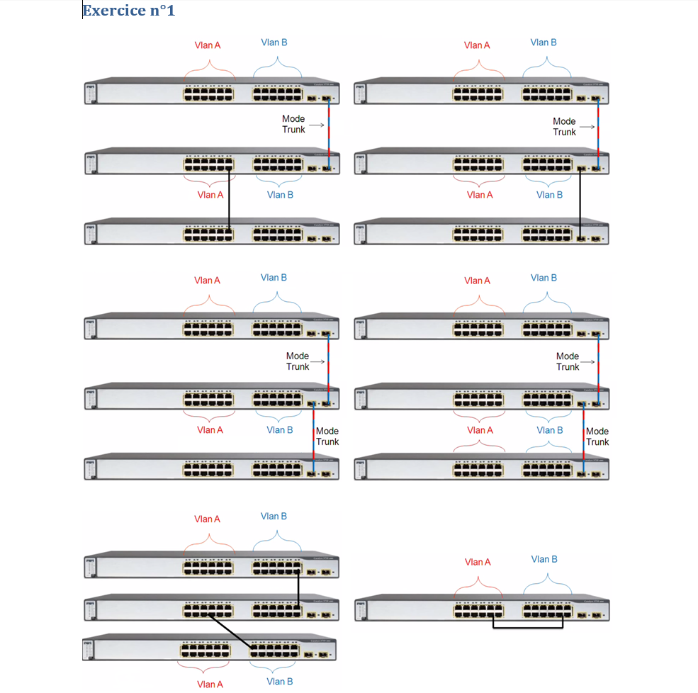
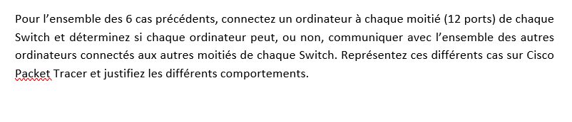
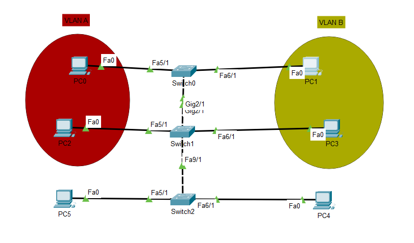

# Network_lab2
Il s'agit du deuxième laboratoire du cours de réseaux et systèmes informatique.

Dans les réseaux d'entreprise modernes, la segmentation du trafic est essentielle pour améliorer la sécurité, l'efficacité et la gestion du réseau. Les VLANs (Virtual Local Area Networks) permettent de diviser un réseau physique en plusieurs réseaux logiques, réduisant ainsi la diffusion inutile du trafic et améliorant l'organisation du réseau.

Le trunking, quant à lui, est un mécanisme permettant de transporter plusieurs VLANs sur un même lien physique entre des commutateurs ou entre un commutateur et un routeur. Il repose généralement sur le protocole IEEE 802.1Q, qui insère un tag VLAN dans les trames Ethernet pour identifier leur appartenance à un VLAN spécifique.

L’objectif de ce deuxième laboratoire est de comprendre et de configurer des VLANs et des liens Trunk sur des équipements réseau, en observant leur impact sur la communication et l’isolation des différents segments du réseau. Nous utiliserons un simulateur pour mettre en place un réseau multi-VLAN et assurer l’interconnexion entre eux à l’aide d’un trunking approprié.

## Qu'est ce qu'un VLAN ?
Un VLAN (Virtual Local Area Network) est un réseau local virtuel permettant de segmenter un réseau physique en plusieurs sous-réseaux logiques. Grâce aux VLANs, des machines physiquement connectées à un même commutateur peuvent être séparées en différents groupes logiques, comme si elles étaient sur des réseaux distincts.

L'objectif principal des VLANs est de réduire la diffusion du trafic, améliorer la sécurité et optimiser la gestion du réseau en regroupant les appareils selon leur fonction, plutôt que selon leur emplacement physique.

## Son fonctionnement
Un VLAN fonctionne en attribuant un identifiant unique (VLAN ID) aux trames réseau, ce qui permet aux équipements de savoir à quel VLAN une trame appartient. Il existe deux types d'interfaces sur un commutateur prenant en charge les VLANs :

 1- Ports d'accès (Access Ports)

    * Un port d'accès appartient à un seul VLAN.

    * Il est généralement utilisé pour connecter des hôtes (PC, imprimantes, etc.).

    * Un PC connecté à un port configuré sur un VLAN spécifique ne pourra communiquer qu’avec d’autres appareils du même VLAN.

2- Ports de Trunk (Trunk Ports)

    * Un port trunk transporte plusieurs VLANs sur un même lien physique.

    * Il utilise un protocole de marquage des trames comme IEEE 802.1Q, qui ajoute un tag VLAN à chaque trame pour indiquer son appartenance.

    * Les trunks sont souvent utilisés pour interconnecter plusieurs commutateurs ou pour relier un commutateur à un routeur.

## Premier exercice du laboratoire

### Configuration 1
Pour ce qui est de la première configuration nous observons 3 switchs, la première et la deuxième communiquent avec du trunking et la deuxième et la troisième communiquent avec une connexion normale (mode access)
donc si l'information rentre dans le premier switch elle continue son chemin jusqu'au 2e switch sans problème (que ce soit pour le Vlan A ou B) car les deux premiers switch sont liés en mode trunk (ce qui veut dire qu'un tag a été ajouté dans la trame pour indiquer s cette dernière est à destination du vlan A ou B) par contre rien ne pourra passer dans le 3e switch car les ports ne font pas partie du meme vlan (donc meme si les 2 derniers switchs sont liés en mode access si les ports ne font pas partie du meme vlan alors aucune information ne sera échangé).
Voici à quoi devrait ressembler la configuration (j'ai ajouté des hosts afin de pouvoir tester le passage de l'information)

