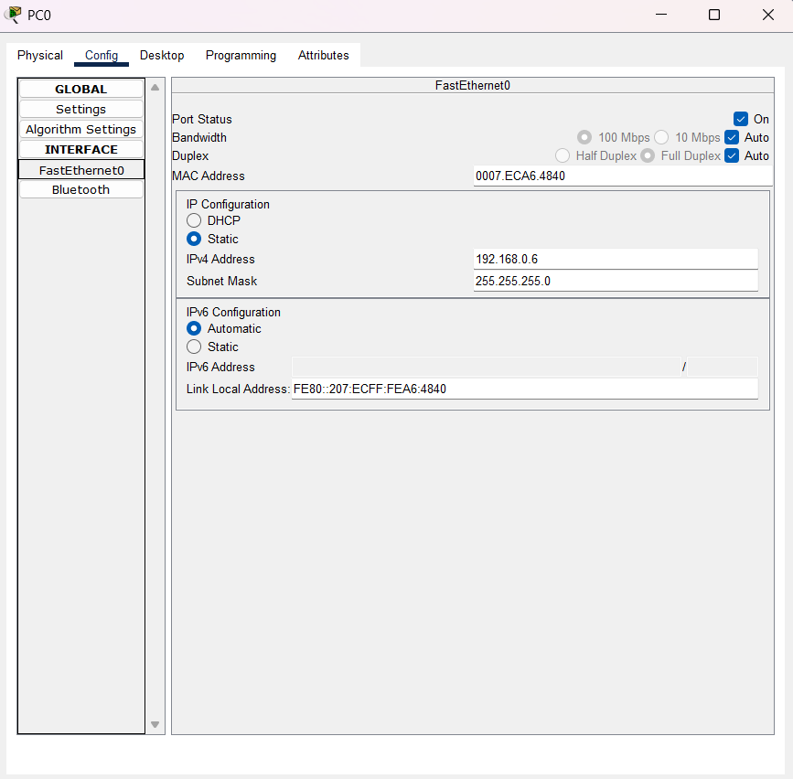

Ce document est destiné à vous aider pour configurer le premier cas, une fois ce document lu vous serez normalement capable de configurer n'importe quel autre cas.

## Configuration des Hosts
Vous allez commencer par ajouter 6 ordinateurs (2 ordinateurs par switch) afin de pouvoir tester la connectivité entre switch plus tard)
après avoir cliqué sur le premier host vous tomberez normalement sur la page de configuration du host (cliquez sur config-->interface utilisé) 
ensuite choisissez une adresse ip et un masque (pour des raisons d'efficacité j'ai juste choisi l'adresse 192.168.0.6 et un masque /24 donc 255.255.255.0)

